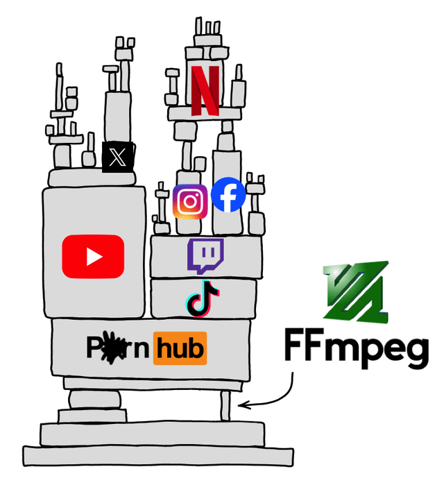
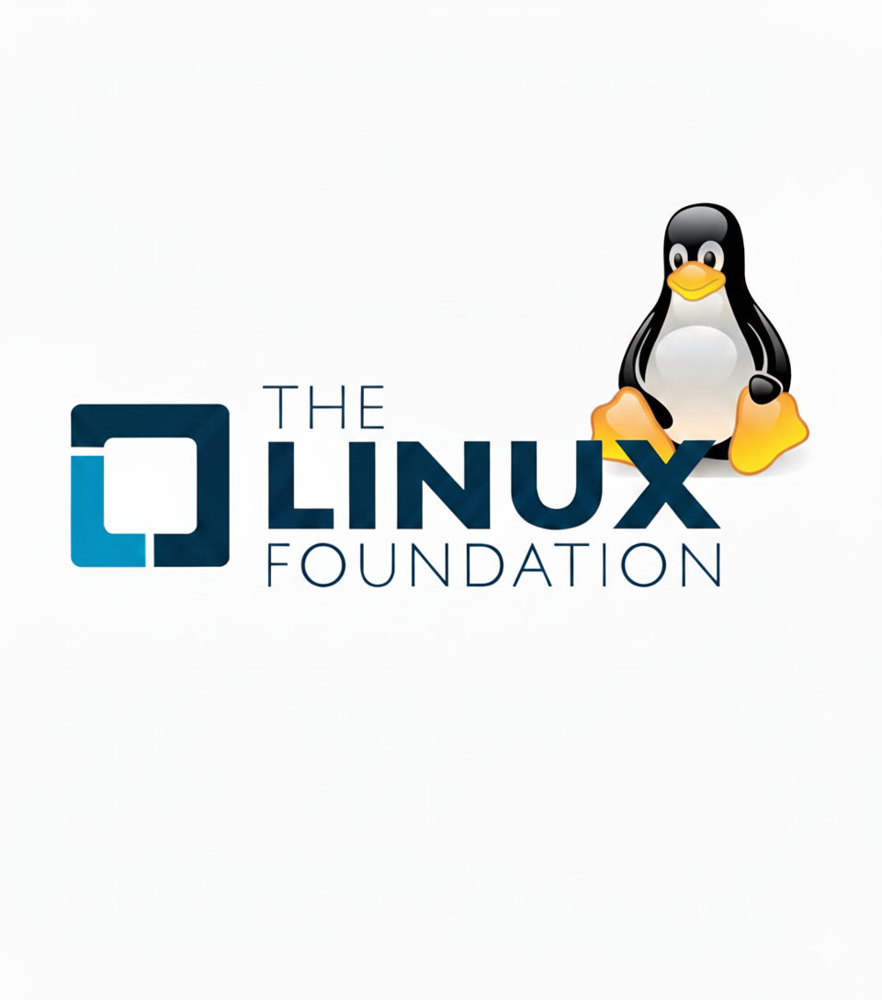

<!-- end_slide -->

<!-- new_lines: 2-->
<!-- font_size: 4 -->
What is Open Source?
===
<!-- alignment: center -->
*Collaboration • Freedom • Transparency*

<!-- alignment: center -->
<!-- font_size: 3-->
##### Open source software makes source code freely available for anyone to **view, modify, and distribute**. 

<!-- new_lines: 0-->
##### It thrives on **community-driven development** and **collaboration**.
<!-- new_lines: 2-->
<!-- alignment: left -->
<!-- font_size: 3 -->
## 🔑 Core Principles

<!-- font_size: 2 -->
<!-- column_layout: [1,1] -->
<!-- list_item_newlines: 2 -->
<!-- column: 0 -->
- 🔍 Transparency: Publicly accessible  
- 🔓 Freedom: Modify & share  
- 🌍 Collaboration: Global contributions  
- 💸 No Fees: Free to use  

<!-- column: 1 -->
- 📝 Peer Review: Community quality checks  
- 🚀 Innovation: Fast development  
- ⚙️ Flexibility: Customizable  
- 🎓 Learning: Real-world code  

<!-- jump_to_middle -->
<!-- reset_layout -->


<!-- end_slide -->

<!-- new_lines: 2-->
<!-- font_size: 4 -->
The Open Source Ecosystem
===


<!-- end_slide -->

<!-- new_lines: 2-->
<!-- font_size: 5 -->
<!-- jump_to_middle -->
<!-- alignment: center -->
*Why Open Source?*
===

<!-- end_slide -->

<!-- new_lines: 4-->
<!-- column_layout: [3,1] -->
<!-- column: 0 -->
<!-- alignment: left -->
<!-- font_size: 3-->
## Skill Development

<!-- font_size: 2-->
1) Real-world coding practice (beyond tutorials/projects)
2) Learn advanced practices: version control (Git), CI/CD, testing, code reviews
3) Exposure to multiple programming languages & frameworks

<!-- new_lines: 2-->
<!-- font_size: 3 -->
## Career Opportunities

<!-- font_size: 2 -->
1) Many companies hire directly from open-source contributors
2) Freelancing & remote job opportunities (upstream contributions are valued)
3) Recognition → speaking invites, conference opportunities

<!-- new_lines: 2-->
<!-- font_size: 3 -->
## Networking & Community

<!-- font_size: 2 -->
1) Connect with experienced developers worldwide
2) Mentorship opportunities
3) Collaborate on large projects with diverse teams

<!-- new_lines: 2-->
<!-- font_size: 3 -->
## Portfolio Building

<!-- font_size: 2 -->
1) Contributions are public (GitHub commits, PRs, issues)
2) Recruiters can see actual code quality, collaboration style, problem-solving
3) Great talking points in interviews

<!-- column: 1 -->

<!-- alignment: center -->

<!-- end_slide -->

<!-- new_lines: 2-->
<!-- font_size: 6 -->
<!-- jump_to_middle -->
Open Source Projects
===
<!-- end_slide -->

<!-- end_slide -->


<!-- end_slide -->


<!-- font_size: 4 -->
How to Get Involved
===

<!-- column_layout: [1,1] -->
<!-- column: 0 -->
<!-- font_size: 3-->
<!-- new_lines: 2-->
## How much Coding needed?

<!-- font_size: 2-->
- Start small, even with basic skills  
- Documentation, typo fixes, testing are also contributions  
- Advanced coding comes later, with practice  

<!-- new_lines: 2-->
<!-- font_size: 3-->
## Which project?

<!-- font_size: 2-->
- Pick projects you already use (VS Code, Python, React)  
- Check "good first issue" on GitHub/GitLab  
- Choose active communities with beginner-friendly repos  
<!-- new_lines: 2-->
<!-- font_size: 3-->
## Communities

<!-- font_size: 2-->
- Join GitHub discussions, Slack/Discord, mailing lists  
- Ask questions politely, follow code of conduct  
- Learn from others’ pull requests  

<!-- column: 1 -->

<!-- new_lines: 3-->
<!-- font_size: 3-->
## Coding only?

<!-- font_size: 2-->
- No! Writing documentation, testing, translation, and design also matter
- You can contribute by writing tutorials or blogs
- Even spreading awareness counts as contribution

<!-- new_lines: 2-->
<!-- font_size: 3-->
## Whats next?

<!-- font_size: 2-->
- Start with small fixes → move to features → maintainership  
- Join open-source programs (GSoC, Hacktoberfest, Outreachy)  
- Mentor new contributors later  

<!-- end_slide -->

<!-- new_lines: 2-->
<!-- font_size: 6 -->
<!-- jump_to_middle -->
One More thing about this PPT
===

<!-- end_slide -->
<!-- new_lines: 4-->
<!-- font_size: 3 -->
### This PPT is hosted on a Raspberry Pi (Opensource)
### This PPT is made on Preseterm (Opensource)
### You can view this PPT by going to this link :
<!-- reset_layout -->
<!-- font_size: 2 -->
<!-- column_layout: [1, 2] -->
<!-- column: 0-->

<!-- column: 1-->

```bash +exec
echo 'http://192.168.0.0:1234' | qrencode -t utf8i -l M
```
<!-- end_slide -->
<!-- font_size: 4 -->
Contact me
===
<!-- reset_layout -->
<!-- font_size: 2 -->
<!-- column_layout: [1, 1] -->
<!-- column: 0 -->
# Github
```bash +exec
echo 'https://github.com/tushar1977' | qrencode -t utf8i -l M

```
<!-- column: 1 -->
# LinkedIn
```bash +exec
echo 'https://linkedin.com/tushar1977124' | qrencode -t utf8i -l M


```
