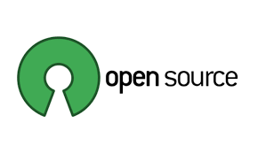
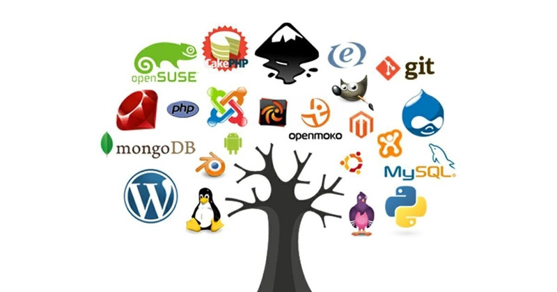

<!-- font_size: 3 -->
What is Open Source?
===
<!-- alignment: center -->
*Collaboration • Freedom • Transparency*

<!-- alignment: center -->
<!-- font_size: 2-->
### Open source software makes source code freely available for anyone to **view, modify, and distribute**.  
### It thrives on **community-driven development** and **collaboration**.
<!-- new_lines: 5-->
<!-- alignment: left -->
<!-- font_size: 2 -->
## 🔑 Core Principles

<!-- font_size: 1 -->
<!-- column_layout: [2,1] -->
<!-- list_item_newlines: 2 -->
<!-- column: 0 -->
- 🔍 Transparency: Publicly accessible  
- 🔓 Freedom: Modify & share  
- 🌍 Collaboration: Global contributions  
- 💸 No Fees: Free to use  

<!-- column: 1 -->
- 📝 Peer Review: Community quality checks  
- 🚀 Innovation: Fast development  
- ⚙️ Flexibility: Customizable  
- 🎓 Learning: Real-world code  

<!-- jump_to_middle -->
<!-- reset_layout -->


<!-- end_slide -->
The Open Source Ecosystem
===


<!-- end_slide -->
Benefits for Developers
===

<!-- font_size: 2-->
## Skill Development

<!-- end_slide -->

How to contribute
===
=======
<!-- font_size: 1-->
1) Real-world coding practice (beyond tutorials/projects)
2) Learn advanced practices: version control (Git), CI/CD, testing, code reviews
3) Exposure to multiple programming languages & frameworks

## Career Opportunities
1) Many companies hire directly from open-source contributors
2) Freelancing & remote job opportunities (upstream contributions are valued)
3) Recognition → speaking invites, conference opportunities

## Networking & Community
1) Connect with experienced developers worldwide
2) Mentorship opportunities
3) Collaborate on large projects with diverse teams

## Portfolio Building
1) Contributions are public (GitHub commits, PRs, issues)
2) Recruiters can see actual code quality, collaboration style, problem-solving
3) Great talking points in interviews
<!-- end_slide -->
Open Source Communities
===
<!-- end_slide -->
Challenges in Open Source
===
<!-- end_slide -->
How to Get Involved
===
<!-- end_slide -->

Contact me
===
<!-- column_layout: [1, 1] -->
<!-- column: 0 -->
# Github
```bash +exec
echo 'https://github.com/tushar1977' | qrencode -t utf8i -l M

```

<!-- column: 1 -->
# LinkedIn
```bash +exec
echo 'https://www.linkedin.com/in/tushar-gupta-75a398283/' | qrencode -t utf8i -l M

```
