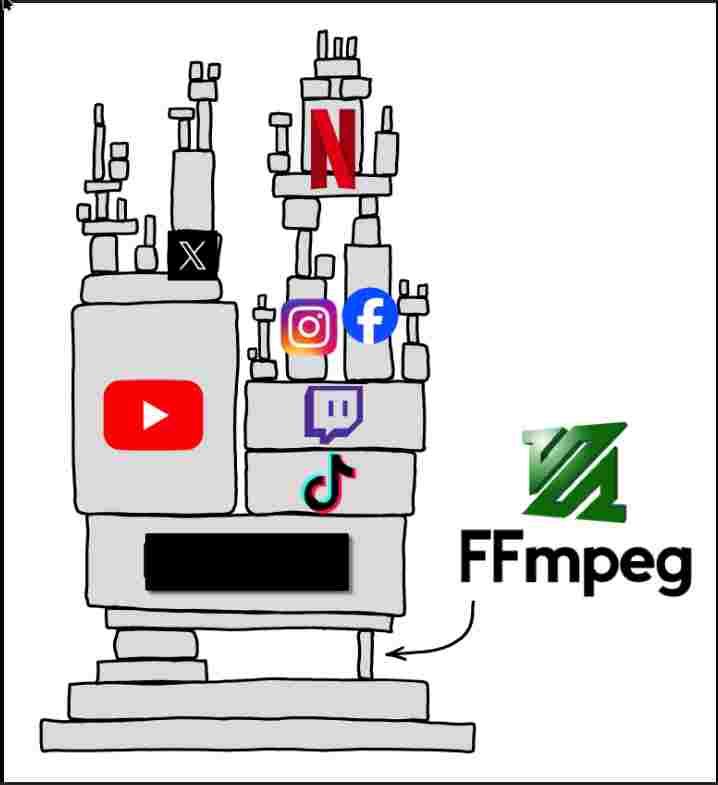

<!-- font_size: 5 -->
<!-- jump_to_middle -->
Open Source
===

<!-- font_size: 2 -->
<!-- alignment: center -->
Made in Presenterm
<!-- new_lines: 10-->
<!-- font_size: 2 -->
Tushar Gupta, Member of SDC

<!-- end_slide -->

<!-- new_lines: 2-->
<!-- font_size: 4 -->
What is Open Source?
===
<!-- alignment: center -->
*Collaboration • Freedom • Transparency*

<!-- alignment: center -->
<!-- font_size: 3-->
##### Open source software makes source code freely available for anyone to **view, modify, and distribute**. 

<!-- new_lines: 0-->
##### It thrives on **community-driven development** and **collaboration**.
<!-- new_lines: 2-->
<!-- alignment: left -->
<!-- font_size: 3 -->
## 🔑 Core Principles

<!-- font_size: 2 -->
<!-- column_layout: [1,1] -->
<!-- list_item_newlines: 2 -->
<!-- column: 0 -->


- <span style="color: #ffffff">🔍 Transparency: Publicly accessible</span>
- <span style="color: #ffffff">🔓 Freedom: Modify & share  </span>
- <span style="color: #ffffff">🌍 Collaboration: Global contributions  </span>
- <span style="color: #ffffff">💸 No Fees: Free to use  </span>
<!--column: 1-->
- <span style="color: #ffffff">📝 Peer Review: Community quality checks  </span>
- <span style="color: #ffffff">🚀 Innovation: Fast development  </span>
- <span style="color: #ffffff">⚙️ Flexibility: Customizable  </span>
- <span style="color: #ffffff">🎓 Learning: Real-world code  </span>

<!-- jump_to_middle -->
<!-- reset_layout -->


<!-- end_slide -->


<!-- end_slide -->
<!-- new_lines: 2-->
<!-- font_size: 4 -->
The Open Source Ecosystem
===


<!-- end_slide -->

<!-- new_lines: 2-->
<!-- font_size: 5 -->
<!-- jump_to_middle -->
<!-- alignment: center -->
*Why Open Source?*
===

<!-- end_slide -->

<!-- new_lines: 4-->
<!-- column_layout: [3,1] -->
<!-- column: 0 -->

<!-- list_item_newlines: 3 -->
<!-- alignment: left -->
<!-- font_size: 3-->
## Skill Development

<!-- font_size: 3-->
- <span style="color: #ffffff"> Learn advanced practices: version control (Git), CI/CD, testing, code reviews</span>
- <span style="color: #ffffff"> Exposure to multiple programming languages & frameworks</span>

<!-- new_lines: 2-->
<!-- font_size: 3 -->
## Career Opportunities

<!-- font_size: 3 -->
- <span style="color: #ffffff"> Many companies hire directly from open-source contributors</span>
- <span style="color: #ffffff"> Freelancing & remote job opportunities (upstream contributions are valued)</span>

<!-- new_lines: 2-->
<!-- font_size: 3 -->
## Networking & Community

<!-- font_size: 3 -->
- <span style="color: #ffffff"> Connect with experienced developers worldwide</span>
- <span style="color: #ffffff"> Collaborate on large projects with diverse teams</span>


<!-- column: 1 -->

<!-- alignment: center -->

<!-- end_slide -->

<!-- new_lines: 2-->
<!-- font_size: 6 -->
<!-- jump_to_middle -->
Open Source Projects
===
<!-- end_slide -->

<!-- end_slide -->


<!-- end_slide -->


<!-- end_slide -->


<!-- font_size: 4 -->
How to Get Involved
===

<!-- column_layout: [1,1] -->

<!-- column: 0 -->
<!-- new_lines: 3-->
<!-- font_size: 3-->
## Coding only?

<!-- font_size: 2-->
<!-- list_item_newlines: 2 -->
- <span style="color: #ffffff">No! Writing documentation, testing, translation, and design also matter</span>
- <span style="color: #ffffff">You can contribute by writing tutorials or blogs</span>
- <span style="color: #ffffff">Even spreading awareness counts as contribution</span>
<!-- new_lines: 2-->
<!-- font_size: 3-->
## Which projects?

<!-- font_size: 2-->

<!-- list_item_newlines: 2 -->
- <span style="color: #ffffff"> Pick projects you already use (VS Code, Python, React)  </span>
- <span style="color: #ffffff"> Check "good first issue" on GitHub/GitLab  </span>
- <span style="color: #ffffff">Choose active communities with beginner-friendly repos  </span>

<!-- column: 1 -->
<!-- new_lines: 5-->
<!-- font_size: 3-->
## Communities

<!-- font_size: 2-->
<!-- list_item_newlines: 2 -->
- <span style="color: #ffffff">Join GitHub discussions, Slack/Discord, mailing lists  </span>
- <span style="color: #ffffff">Ask questions politely, follow code of conduct  </span>
- <span style="color: #ffffff">Learn from others’ pull requests  </span>


<!-- end_slide -->

<!-- font_size: 4 -->
What Not to do?
===


<!-- end_slide -->

<!-- alignment: center-->


<!-- end_slide -->
<!-- new_lines: 3-->
<!-- alignment: center-->
<!-- font_size: 5-->
Competitions & Programs
===

<!-- end_slide -->

<!-- new_lines: 3-->

<!-- alignment: center-->
<!-- column_layout: [1,1] -->
<!-- column: 0-->


<!-- font_size: 3-->
<!-- new_lines: 1-->
### Starts From March
### *Stripend* : $1,200
<!-- new_lines: 2-->

<!-- font_size: 3-->
<!-- new_lines: 1-->
### Starts From December
### *Stripend*: €500 – €1200

<!-- column: 1-->

<!-- new_lines: 5-->

<!-- font_size: 3-->
### Starts From July
### *Stripend*: ₹20,000 – ₹40,000


<!-- end_slide -->
<!-- new_lines: 2-->
<!-- font_size: 4 -->
Resources
===
<!-- jump_to_middle-->
<!-- column_layout: [1,1]-->
<!-- column: 0-->
#### Github

<!-- list_item_newlines: 2 -->
<!-- font_size: 2 -->
- https://www.youtube.com/watch?v=rH3zE7VlIMs&t=6858s
- https://www.youtube.com/watch?v=q8EevlEpQ2A&t=8645s

<!-- column: 1-->
<!-- font_size: 4 -->
#### GSOC

<!-- font_size: 2 -->
- https://www.gsocorganizations.dev/
<!-- end_slide -->

<!-- font_size: 3-->


<!-- new_lines: 2-->
<!-- font_size: 6 -->
<!-- jump_to_middle -->
One More thing about this PPT
===

<!-- end_slide -->
<!-- new_lines: 4-->
<!-- font_size: 3 -->
### This PPT is hosted on a Raspberry Pi (Opensource)
### This PPT is made on Presenterm (Opensource)
### You can view this PPT by going to this link :
<!-- reset_layout -->
<!-- font_size: 2 -->
<!-- column_layout: [1, 2] -->
<!-- column: 0-->

<!-- column: 1-->

```bash +exec
echo 'http://192.168.0.0:1234/pdf' | qrencode -t utf8i -l M
```
<!-- end_slide -->
<!-- font_size: 4 -->
Contact me
===
<!-- reset_layout -->
<!-- font_size: 2 -->
<!-- column_layout: [1, 1] -->
<!-- column: 0 -->
# Github
```bash +exec
echo 'https://github.com/tushar1977' | qrencode -t utf8i -l M

```
<!-- column: 1 -->
# LinkedIn
```bash +exec
echo 'https://linkedin.com/tushar1977124' | qrencode -t utf8i -l M


```
